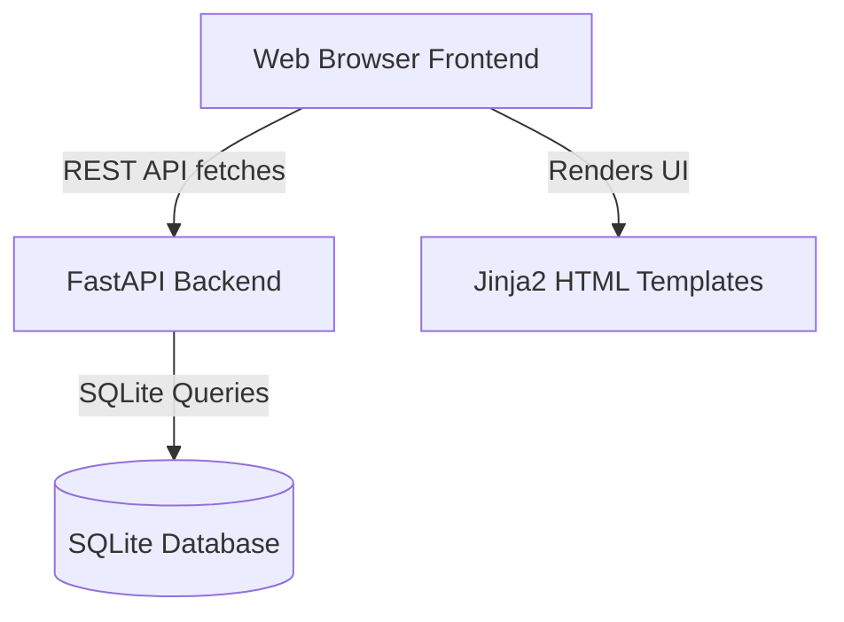

# 🌌 Solo Leveling Productivity Tracker

A gamified, RPG-style productivity dashboard inspired by the hit anime *Solo Leveling*. This application converts your real-world daily tasks, habits, and projects into quests, dungeons, and raids, allowing you to level up from an E-Rank hunter to a shadow-commanding S-Rank Monarch.

---

## 🎮 Core Gameplay Mechanics

### 1. Hunter Profile & Attributes
Your dashboard displays your character identity with dynamically scaling elements:
* **Hunter Name & Rank:** Overwrite your hunter tag at any time. Your Hunter Rank scales dynamically based on your level.
* **Level & XP Bar:** Tracks your progress using a linear RPG scaling progression.
* **Core Attributes:**
  * **INT (Intellect):** Levelled up by completing cognitive/learning tasks.
  * **AGI (Agility):** Levelled up by physical/exercise tasks.
  * **WIL (Willpower):** Levelled up by discipline/habit-retention tasks.

### 2. The Multiplier Streak System
Consistency boosts your power. The system tracks your daily task completions:
* **Daily Reset:** Quests reset at midnight.
* **Streak Multiplier:** Every consecutive day you complete all quests, your streak increases. Your XP gains are multiplied by:
  $$\text{Multiplier} = 1.0 + (\text{Streak Count} \times 0.01) \quad (\text{Capped at } 3.0\text{x})$$
* **Streak Critical State (Grace Period):** If you miss a day, your streak isn't immediately lost. The system enters a **Critical Warning** state (`missed_yesterday = 1`). You have until midnight of the current day to complete all quests and save your streak.
* **Streak Shield:** Collectible inventory items (Runic Crystals) with a `streak_shield` effect will automatically consume themselves to protect your streak if you miss two consecutive days.

### 3. Dimensional Deviations (Red Gates)
High-stakes, deadline-bound tasks representing major real-world exams or high-priority items:
* **Multiplier Rewards:** Spawning a Red Gate applies a custom reward multiplier.
* **Failure Penalty:** If the gate deadline expires before completion, the gate fails and applies a major XP penalty (deducted from your stats).

### 4. Campaign Skirmishes (Raids & Projects)
Large-scale, multi-objective projects. The name of the campaign dynamically scales to match your Hunter Rank:
* **E-Rank:** Commissions
* **D-Rank:** Skirmishes
* **C-Rank:** Dungeons
* **B-Rank:** Subjugations
* **A-Rank:** Conquests
* **S-Rank:** Raids

### 5. System Shop & Runes Collectibles
Spend the gold you earn from quests on rewards:
* **Shop Marketplace:** Stock custom real-life rewards (e.g., "1 Hour Gaming" or "Buy Coffee") and purchase them.
* **Loot Drops:** Completing quests has a 20% chance to drop mystical crystals.
* **Inventory grid:** Display acquired Runes and Essences, tracking passive modifiers (such as Streak Shields).

---

## 📐 Mathematical Progression System

The system uses a linear growth curve designed to make reaching **Level 100** a challenging, long-term self-improvement journey (taking between **6 months to 1.5 years** depending on consistency):

$$\text{XP Required} = 100 + 60 \times (\text{level} - 1)$$

### 📊 Level requirements snapshots:
* **Level 1 $\rightarrow$ 2:** $100$ XP
* **Level 10:** $640$ XP
* **Level 50:** $3,040$ XP
* **Level 100:** $6,040$ XP
* **Total Cumulative XP (Level 1 $\rightarrow$ 100):** **$300,960$ XP**

### 🛡️ Hunter Rank Brackets
Your Hunter Rank updates automatically as you grow:
| Rank | Level Range | Theme Color |
| :--- | :--- | :--- |
| **E-Rank** | Level 1 – 9 | Slate Grey |
| **D-Rank** | Level 10 – 24 | Electric Green |
| **C-Rank** | Level 25 – 44 | Cool Blue |
| **B-Rank** | Level 45 – 69 | Mystic Indigo |
| **A-Rank** | Level 70 – 89 | Amber Orange |
| **S-Rank** | Level 90+ | Glowing Red Aura |

---

## 🛠️ Technical Architecture

The application is lightweight, built with a modern fast-performance stack:



### 1. Backend (`app.py`)
* **Core Framework:** FastAPI
* **Database:** SQLite (local `database.db` file)
* **API Endpoints:** RESTful JSON endpoints for players, quests, gates, projects, and inventory operations.
* **Date Simulation Engine:** Includes offset capabilities to mock and fast-forward system dates to test daily resets, warnings, and streak decays.

### 2. Frontend (`templates/index.html`)
* **Styling:** TailwindCSS (via CDN) + custom premium dark style themes.
* **Visual Effects:** Canvas particle animation simulating drifting magical energy.
* **Dynamic Color Adjustments:** Automatically interpolates background borders and shadows from electric blue at Level 5 to Monarch purple as you approach S-Rank.
* **Responsive Design:** Twelve-column CSS grid scaling from mobile viewport to widescreen.

### 3. Developer Admin directives Console
Press the backtick (`` ` ``) key or click the gear icon to open the admin command line interface overlay.
* `/player_info` — Detailed state summary
* `/set_level <N>` — Instantly override level and scale ranks
* `/add_xp <N>` — Add test XP
* `/drop_crystal` — Force-spawn a random collectible
* `/offset_date <days>` — Fast forward time to test daily resets
* `/reset_all` — Full database wipe to Level 1 E-Rank

---

## 🚀 Setup & Execution Instructions

Ensure you have Python 3.8+ installed.

1. **Clone & Navigate:**
   ```bash
   cd ANIT/solo-leveling-tracker
   ```
2. **Activate Virtual Environment:**
   * **Windows:**
     ```bash
     .venv\Scripts\activate
     ```
   * **macOS/Linux:**
     ```bash
     source .venv/bin/activate
     ```
3. **Install Dependencies:**
   ```bash
   pip install -r requirements.txt
   ```
4. **Run Server:**
   ```bash
   uvicorn app:app --reload
   ```
5. **Open Browser:**
   Go to `http://127.0.0.1:8000` to access the System Interface.

## 🤖 Model Context Protocol (MCP) Server

The Solo Leveling Productivity Tracker exposes its database operations to model clients via a Model Context Protocol (MCP) server interface (`mcp_server.py`). This allows any MCP-compliant AI agent (such as Google Antigravity or Claude Desktop) to directly read your stats, view active quests, complete tasks, and buy shop items.

### Exposed Tools:
* `get_hunter_status` - Retrieve stats, levels, gold, and streaks.
* `view_quests` - View daily quest states and reward amounts.
* `clear_quest` - Mark a quest as completed using its integer ID.
* `view_shop` - View items and pricing in the system shop.
* `buy_item` - Spend gold to buy/redeem a shop item using its integer ID.

### Configuration for MCP Client:
To add this tracker to your local MCP client configuration, define the following server block:
```json
{
  "mcpServers": {
    "solo-leveling-tracker": {
      "command": "python",
      "args": ["C:/Users/smoni/OneDrive/DESKTOP 2/ANIT/solo-leveling-tracker/mcp_server.py"]
    }
  }
}
```


